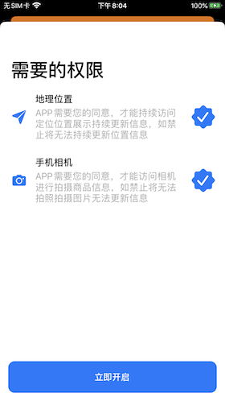

# CocoPods集成：

####  `pod 'SimplePermission'`

### 效果演示


## 暗黑模式适配




# 使用方法

```objc
UIImage *seletedImage = [UIImage systemImageNamed:@"checkmark.seal.fill"];
        
NSDictionary *music_dict = [NSDictionary dictionaryWithObjects:@[
    [UIImage systemImageNamed:@"camera.fill"],
    seletedImage,
    @"手机相机",
    @"APP需要您的同意，才能访问相机进行拍摄商品信息，如禁止将无法拍照拍摄图片无法更新信息",
    @(SimplePermissionType_Camera)]
    forKeys:@[
    @"iconImage",
    @"selectedImage",
    @"name",
    @"describe",
    @"type"]];

[SimplePermission showAuthorizeControllerWithType:@[music_dict] toViewController:self];
```
