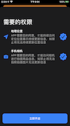

# SimplePermission
A simple permissions framework to start an App for the first time and request the required permissions in turn.

# SimplePermission 权限请求框架

------

#cocopods集成：

> * **`pod 'SimplePermission'`**

# 效果演示

## 暗黑模式适配

